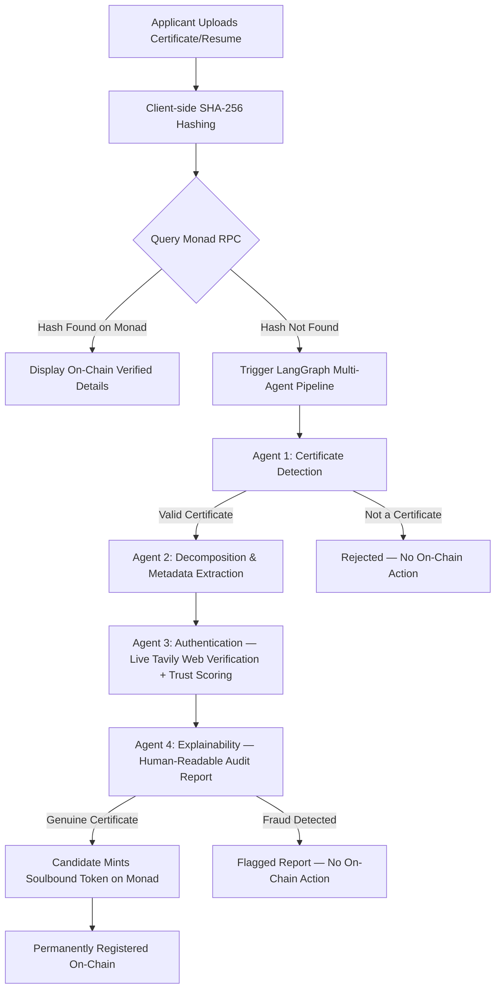

# 🛡️ CertiChain AI: Cryptographic Credential Registry on Monad

> **Eliminating Resume and Certificate Fraud at the Source.**
> CertiChain AI fuses a **Multi-Agent LangGraph intelligence layer** (LLaMA-3.3-70B via Groq) with the parallel-execution power of the **Monad Layer 1 blockchain** to make digital credentials cryptographically tamper-proof, instantly verifiable, and explainable — not just "trust us."

<p align="center">
  
  
  
  
</p>

---

## ⚡ Why Monad?

Traditional credential verification — background-check vendors, manual HR calls to universities, PDF-eyeballing — takes **days to weeks** and costs real money per candidate, and it still only verifies what the issuer is willing to confirm over email.

Putting credentials on-chain solves the trust problem, but most EVM chains can't support it at consumer scale: gas spikes during demand, multi-second block times kill the "instant verify" UX, and congestion makes bulk institutional registration (think: a university minting thousands of diplomas at graduation) impractical.

**CertiChain AI is built specifically around what Monad makes possible:**

| Monad Capability | What it unlocks for CertiChain AI |
|---|---|
| **Parallel Execution Engine** | Concurrent, high-throughput hash registrations — a university can batch-register an entire graduating class without queueing or fee spikes. |
| **~1s block times & near-instant finality** | The "Live Verification Check" on the portal feels instantaneous, not "submitted, check back later." |
| **Full EVM compatibility** | Our Solidity contract, ABI, and tooling (viem/wagmi/RainbowKit) work exactly like any other EVM chain — no rewrites, no new mental model. |
| **Low, stable gas costs at scale** | Registration stays cheap even under traffic spikes (e.g. exam-result day), which is exactly when verification demand is highest. |
| **Soulbound (non-transferable) ERC-721 tokens** | Each verified credential's SHA-256 hash + metadata is bound permanently to the candidate's wallet — it can't be sold, faked, or moved like a regular NFT. |

In short: AI tells you *whether* a certificate is genuine. Monad makes that verdict **permanent, public, and instantly checkable by anyone** — without re-running the AI pipeline every time.

---

## 🏗️ Architecture Overview



**The core idea:** the blockchain is checked *first*, before any LLM call. If a hash is already registered on Monad, verification is a free, instant, deterministic lookup — the AI pipeline only runs for *new* credentials that haven't been registered yet. This keeps verification cheap and fast for everyone after the first check, and means trust ultimately rests on-chain, not on a model's output in that moment.

---

## 🧱 Tech Stack

| Layer | Technology |
|---|---|
| **Blockchain** | Solidity, Monad Testnet (Chain ID `10143`, native gas token `MON`) |
| **Contract Tooling** | Custom compile/deploy scripts (`compile_to_json.py`, `deploy.py`) |
| **Web3 Frontend** | Next.js (Turbopack) + TypeScript, wagmi, viem, RainbowKit (wallet connect) |
| **AI Orchestration** | LangGraph (state graph of 4 agents) |
| **LLM** | Groq — `llama-3.3-70b-versatile` (via `langchain-groq`) |
| **Web Verification** | Tavily Search API (real-time lookup of institution/cert ID legitimacy) |
| **OCR / Ingestion** | PyMuPDF (`fitz`) + Tesseract OCR + OpenCV (QR/barcode decoding) |
| **Python Backend** | `server.py` — serves `/api/verify` and bridges the frontend to the LangGraph pipeline + on-chain calls |
| **Secondary UI** | Streamlit (`app.py`) — lightweight standalone interface for the AI pipeline alone, no wallet required |

---

## 🤖 The Four Agents

| # | Agent | Job |
|---|---|---|
| 1 | **Certificate Detection** | Is this even a certificate? Checks layout, header patterns, completion language, institution mentions. Rejects non-certificates before burning any further compute. |
| 2 | **Decomposition** | Extracts structured fields: institution name, candidate name, certificate ID, issue/expiry dates, serial number, QR/barcode data, signature & seal presence. |
| 3 | **Authentication** | Cross-checks extracted data against a **live web search** (Tavily) for the institution's real verification portal, validates QR/date/signature plausibility, and produces a `trust_score` + list of `fraud_signals`. |
| 4 | **Explainability** | Turns the raw scores into a human-readable VERIFIED / FRAUD DETECTED report with stated reasons — no black-box verdicts. |

If a certificate passes through Agents 1–4 as genuine, the candidate can then mint a **Soulbound Token on Monad** containing the document's SHA-256 hash, making future verification of that exact document instant and free for anyone, forever — no LLM call required.

---

## 📂 Project Structure

```
CertiChain_AI/
├── contracts/
│   ├── CertiChainMonad.sol       # Soulbound ERC-721 credential registry
│   └── CertiChainMonad.json      # Compiled ABI + bytecode
├── frontend/                     # Next.js dApp (wallet connect + live UI)
│   ├── app/
│   │   ├── layout.tsx
│   │   ├── page.tsx               # main verification flow + contract calls
│   │   └── providers.tsx          # wagmi / RainbowKit setup
│   └── package.json
├── agents/                       # LangGraph agent classes
│   ├── certificate_detector.py
│   ├── decomposition_agent.py
│   ├── authentication_agent.py
│   └── explainability_agent.py
├── graph/
│   ├── state.py                   # shared TypedDict state
│   └── workflow.py                # LangGraph StateGraph wiring
├── server.py                      # Python backend API for the Next.js frontend
├── blockchain.py                  # web3 helpers: hashing, on-chain read/write, ABI
├── deploy.py                      # deploys CertiChainMonad.sol to Monad testnet
├── compile_to_json.py             # Solidity -> ABI/bytecode JSON
├── ingest.py                      # OCR + QR/barcode extraction
├── llm.py                         # Groq LLM client
├── app.py                         # standalone Streamlit UI (AI-only, no wallet)
├── main.py                        # CLI entry point for the AI pipeline
├── requirements.txt
└── .env                           # API keys & chain config (see below)
```

---

## 🚀 Getting Started

### 1. Prerequisites

- Python 3.11+
- Node.js 18+ and npm
- [Tesseract-OCR](https://github.com/UB-Mannheim/tesseract/wiki) installed system-wide (for scanned/image certificate OCR)
- A wallet (e.g. MetaMask) funded with testnet **MON** from the [Monad faucet](https://faucet.monad.xyz)
- Groq API key — [console.groq.com/keys](https://console.groq.com/keys)
- Tavily API key — [app.tavily.com](https://app.tavily.com)

### 2. Configure environment variables

Create `.env` in the project root:

```env
# AI layer
GROQ_API_KEY=your_groq_api_key
TAVILY_API_KEY=your_tavily_api_key

# Monad layer
MONAD_RPC_URL=https://testnet-rpc.monad.xyz
MONAD_CHAIN_ID=10143
DEPLOYER_PRIVATE_KEY=your_wallet_private_key   # only needed to run deploy.py
CONTRACT_ADDRESS=0xYourDeployedContractAddress
```

> ⚠️ Never commit `.env` or any private key to version control. Add `.env` to `.gitignore`.

### 3. Set up and run the Python (AI + backend) layer

```powershell
uv venv
.venv\Scripts\activate
uv pip install -r requirements.txt

# Compile + deploy the contract (first time only)
python compile_to_json.py
python deploy.py

# Start the backend API the frontend talks to
python server.py
```

### 4. Set up and run the frontend (dApp)

```powershell
cd frontend
npm install
npm run dev
```

Visit **http://localhost:3000** — connect your wallet, upload a certificate, and watch it check Monad first, then fall back to the AI pipeline if the hash isn't registered yet.

### 5. (Optional) Run the AI pipeline standalone, no wallet needed

```powershell
.venv\Scripts\python.exe -m streamlit run app.py
```

or via CLI:

```powershell
.venv\Scripts\python.exe main.py path\to\certificate.pdf
```

---

## 🔐 Smart Contract: `CertiChainMonad.sol`

A Soulbound (non-transferable) ERC-721 registry. Each token represents one verified credential, permanently bound to the wallet that registered it.

| Function | Purpose |
|---|---|
| `registerCredential(bytes32 docHash, ...)` | Mints a new soulbound token for a verified credential's hash + metadata. |
| `hashToTokenId(bytes32 docHash)` | Instant lookup — does this exact document hash already exist on-chain? Returns the token ID if so. |
| Transfer functions | Overridden/disabled — tokens are non-transferable by design, enforcing the soulbound property. |

**Network:** Monad Testnet · Chain ID `10143` · Explorer: [testnet.monadexplorer.com](https://testnet.monadexplorer.com)

---

## 🗺️ Roadmap

- [ ] Migrate from per-document trust scoring to fully on-chain-anchored institution registries (so even Agent 3's "is this institution real" check resolves on-chain).
- [ ] Batch registration endpoint for institutions to mint an entire cohort's credentials in one transaction, leaning on Monad's parallel execution.
- [ ] Unify the standalone Streamlit UI and the Next.js dApp into a single experience.
- [ ] Mainnet deployment once contract is audited.

---

## 📄 License

MIT — see `LICENSE` for details.

---

## 🙏 Acknowledgements

Built for [hackathon name] on **Monad**, using **Groq** for inference and **Tavily** for live web verification.
